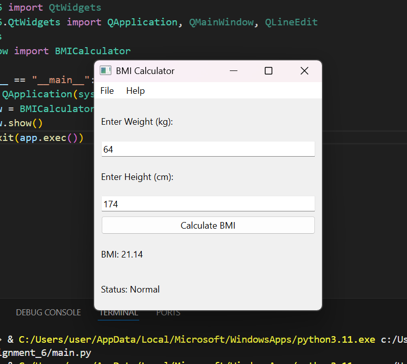

# Assignment_6_OOP

# BMI Calculator

A simple BMI calculator application built with PyQt. Users can input their weight and height to calculate their Body Mass Index (BMI) and view their BMI classification (Underweight, Normal, Overweight, or Obese).

## Features
- Input weight (kg) and height (m).
- Calculate BMI using the formula: `BMI = Weight(kg) / Height(m)^2`.
- Displays BMI value and status (Underweight, Normal, Overweight, Obese).
- Menu bar with options for "Exit", "Clear", and "Help".

## BMI Categories
- **Underweight**: BMI < 18.5
- **Normal**: 18.5 ≤ BMI < 25
- **Overweight**: 25 ≤ BMI < 30
- **Obese**: BMI ≥ 30

## Requirements
- Python 3.x
- PyQt5 (`pip install PyQt5`)

## Usage
1. Clone the repo: `git clone https://github.com/yourusername/bmi-calculator.git`
2. Run the app: `python bmi_calculator.py`

## Screenshots
- Example 1: BMI = 21.14 (Normal)
- 
- Example 2: BMI = 33.03 (Obese)
- 

## License
MIT License
